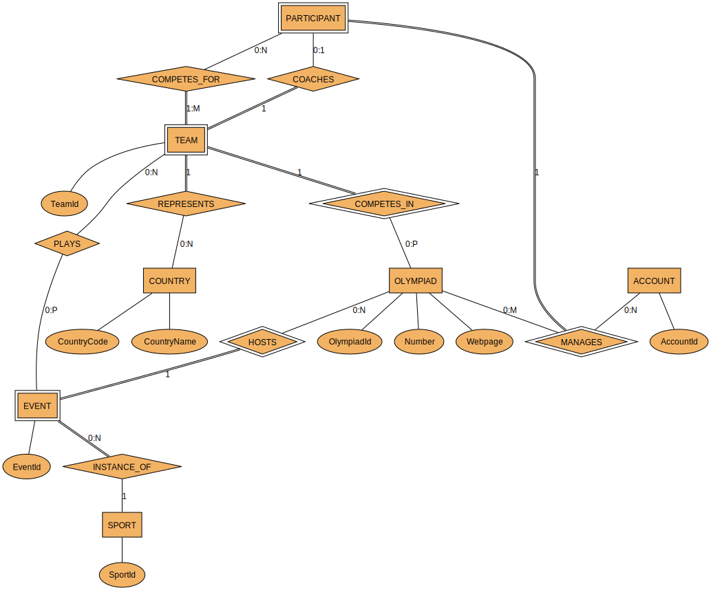

# CS 1555 Term Project

## Phase 1
The most recently committed SVG of the diagram is shown below.

I use `dot -Tsvg er-model-diagram.dot > out.svg` to compile the DOT file to an SVG.

You can download GraphViz [here](https://graphviz.org/download/). Alternatively, if you have Homebrew installed on Mac, you can do `brew install graphviz`.

## Phase 2

For phase 2, please refer to `schema.sql`, `triggers.sql`, and `functions.sql`.

## Phase 3

In addition to the phase 2 files, refer to `analytical.sql`.

### Testing with pgTAP

If you happen to have pgTAP installed, you can run the tests with these steps:

1. Run `CREATE EXTENSION IF NOT EXISTS pgtap;`
2. Enter the working directory in the command line for this project
3. Run `pg_prove -U postgres -d cs1555 t/*/*.sql`
	* Replace postgres with the database user
	* Replace cs1555 with the database schema name
	* Note that you must link Perl when installing Postgres to use `pg_prove`

## Running the OlympicDB Application

To run via terminal:  
	<strong>compile - </strong> javac -cp postgresql-42.7.3.jar OlympicDB.java  
	<strong>run - </strong> java -cp postgresql-42.7.3.jar:. OlympicDB.java  

To run via IDE (VS Code):  
	Press `Run Java` button in editor.  

How to use the command-line interface:

* The CLI will first prompt you for your password for user "postgres" (your individiual password to access postgres on your local machine).
* Upon successful login, you will be met with a list of possible operations to perform on the database, each assigned with a number
* Enter the number of the operation you would like to perform, and the interface will direct you to the proper prompts, depending on if the operation requires inputs.
* After successful completion of the operation or a proper display of the error message if something were to go on, you are redirected to the same list of possible operations as shown before.
* You can continue to perform different operations, or simply enter 23 (exit) to close the database connection and exit the app.
